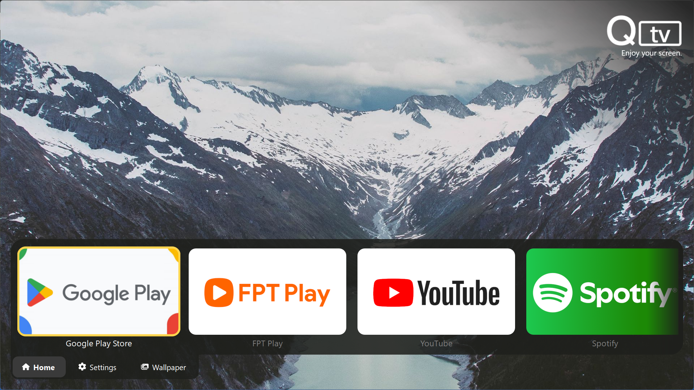

<h3>Ứng dụng của bạn. Màn hình của bạn. Theo cách của bạn.</h3>

Giao diện TV hiện đại dành cho PC. Q-TV mang đến trải nghiệm đơn giản, thân thiện với điều khiển từ xa cho desktop của bạn với thiết kế ưu tiên ứng dụng (app-first).

 

 

#### Thiết kế cho

[Englist](README.md) | [Tiếng Việt](README-vi.md)

## Ảnh màn hình

 
Giao diện Q-TV Shell · Trình khởi chạy ứng dụng và điều hướng kiểu TV

## Mục lục

- [Giới thiệu](#giới-thiệu)
- [Trạng thái](#trạng-thái)
- [Tính năng](#tính-năng)
- [Nền tảng mục tiêu](#nền-tảng-mục-tiêu)
- [Yêu cầu hệ thống và Khuyến nghị](#yêu-cầu-hệ-thống-và-khuyến-nghị)
- [Cài đặt](#cài-đặt)
- [Lộ trình phát triển](#lộ-trình-phát-triển)
- [Ngôn ngữ](#ngôn-ngữ)
- [Đóng góp](#đóng-góp)
- [Câu hỏi thường gặp (FAQ)](#câu-hỏi-thường-gặp-faq)
- [Giấy phép](#giấy-phép)

## Giới thiệu

Q-TV là một nền tảng Smart TV Open Source được thiết kế để biến PC và laptop thành một trải nghiệm giống như TV, đồng thời mang lại mục đích sử dụng mới cho các phần cứng cũ.

Lấy cảm hứng từ các hệ thống Smart TV hiện đại, Q-TV cung cấp một giao diện thân thiện với điều khiển từ xa được xây dựng trên nền tảng Linux. Thay vì phụ thuộc vào Android TV x86, Q-TV sử dụng Linux làm nền tảng cốt lõi, cho phép khả năng tùy biến cao hơn, tính linh hoạt về phần cứng và mở ra các khả năng trong tương lai như TV box chuyên dụng hoặc tích hợp OEM.

Q-TV kết hợp một Shell tập trung cho TV, các ứng dụng native và hỗ trợ ứng dụng Android TV thông qua Waydroid. Dự án hướng tới mục tiêu trở thành cả một hệ điều hành TV dựa trên Linux và một nền tảng TV mở cho PC, với bản image chính thức dự kiến được xây dựng dựa trên Fedora Minimal.

## Trạng thái

Q-TV hiện đang trong giai đoạn phát triển ban đầu (early development) và chưa dành cho mục đích sử dụng hàng ngày. Dự án đang tập trung xây dựng trải nghiệm TV cốt lõi, bao gồm Shell, hệ thống điều hướng và hệ sinh thái ứng dụng.

| Thành phần | Trạng thái |
|---|---|
| Q-TV Shell | 🟡 Beta |
| Hệ thống điều hướng | 🟠 Thử nghiệm |
| Hệ thống hình nền | 🟠 Thử nghiệm |
| Ứng dụng native | 🔵 Phát triển ban đầu |
| Tích hợp Waydroid | ⚪ Theo kế hoạch |
| Q-TV Image | ⚪ Theo kế hoạch |

> [!NOTE]
> Các tính năng có thể thay đổi, bị lỗi hoặc được thiết kế lại trong quá trình phát triển dự án.
> Dự án vẫn đang ở giai đoạn phát triển ban đầu, chưa có phiên bản phát hành chính thức.

## Tính năng

### Trải nghiệm TV

- 📺 Giao diện lấy cảm hứng từ Smart TV, được thiết kế cho màn hình lớn và thân thiện với điều khiển từ xa.
- 🎮 Điều hướng kiểu D-pad với hỗ trợ đầu vào từ bàn phím và điều khiển từ xa.
- ✨ Hiệu ứng focus mượt mà và phản hồi trực quan cho các tương tác kiểu TV.
- 🖼️ Hệ thống hình nền động hỗ trợ nhiều nguồn cung cấp (wallpaper providers) khác nhau.

### Nền tảng ứng dụng

- 🚀 Q-TV Shell mang đến trải nghiệm trình khởi chạy (launcher) thống nhất.
- 🧩 Các ứng dụng native của Q-TV được thiết kế dành riêng cho giao diện TV.
- 📱 Tích hợp ứng dụng Android TV thông qua Waydroid.
- 🛒 Q-TV Store để khám phá và quản lý các ứng dụng.
- 🔌 Hệ thống Extension để bổ sung các tính năng mới, ví dụ như tùy chỉnh nguồn cấp hình nền.

### Ứng dụng tích hợp sẵn

Q-TV đi kèm với một bộ sưu tập các ứng dụng native đang ngày càng hoàn thiện:

| Ứng dụng | Mô tả |
|---|---|
| Settings | Quản lý các tùy chọn cài đặt và cấu hình hệ thống của Q-TV |
| File Manager | Duyệt và quản lý các tệp tin cục bộ |
| Q-TV Entertainment Center | Xem truyền hình trực tiếp, phim ảnh và truy cập nội dung media cục bộ |
| Store | Khám phá và quản lý các ứng dụng Q-TV |

### Tích hợp nền tảng

- 🐧 Kiến trúc dựa trên Linux được thiết kế mang lại sự linh hoạt và khả năng tùy biến cao.
- 💻 Hỗ trợ tái sử dụng các PC và laptop cũ thành thiết bị Smart TV.
- 📦 Dự kiến cung cấp Q-TV Image với môi trường Linux chuyên biệt cho TV.
- 🔧 Kế hoạch bổ sung trải nghiệm thiết lập lần đầu (OOBE) giúp cấu hình thiết bị dễ dàng hơn.

## Nền tảng mục tiêu

Q-TV được thiết kế chủ yếu cho môi trường Linux, tập trung vào các hệ thống desktop hiện đại sử dụng Wayland và có hỗ trợ Qt.

Q-TV Shell được thiết kế để chạy trên nhiều bản phân phối Linux khác nhau. Các môi trường hiện đã được kiểm thử bao gồm:

> [!NOTE]
> Các bản phân phối Linux khác có môi trường Wayland và Qt tương thích dự kiến cũng sẽ hoạt động tốt.
> Mức độ tương thích có thể thay đổi tùy thuộc vào desktop environment, graphics stack và cấu hình hệ thống.

### Q-TV Image chính thức

Q-TV Image chính thức được lên kế hoạch là một môi trường Linux chuyên dụng cho TV dựa trên Fedora Minimal.

| Phần cứng mục tiêu | Trạng thái |
|---|---|
| PC và laptop cũ | Theo kế hoạch |
| Mini PC | Theo kế hoạch |
| Thiết bị ARM (VD: Raspberry Pi) | Cân nhắc trong tương lai |

### Kiến trúc

| Kiến trúc | Trạng thái |
|---|---|
| x86_64 | Mục tiêu chính |
| ARM64 | Hiện chưa có kế hoạch |

> [!NOTE]
> Hỗ trợ Windows hiện chưa có trong kế hoạch của dự án Q-TV chính thức. Tuy nhiên, các bản port hoặc các bản triển khai từ cộng đồng có thể xuất hiện trong tương lai.

## Yêu cầu hệ thống và Khuyến nghị

Q-TV được thiết kế để chạy trên nhiều phần cứng PC, bao gồm cả các hệ thống cũ được tái sử dụng thành thiết bị Smart TV.

### Yêu cầu tối thiểu

| Thành phần | Yêu cầu |
|---|---|
| 🧠 CPU | Intel Core i3 Thế hệ 4 (Haswell) hoặc mới hơn AMD Ryzen 3 hoặc tương đương |
| 💾 RAM | 6GB |
| 📂 Lưu trữ | Trống 8GB |
| 🎮 Đồ họa | Card đồ họa tích hợp hoặc GPU rời cấp thấp (VD: dòng NVIDIA GTX 750 Ti) |
| 🖥️ Màn hình | Độ phân giải 1024×768 trở lên |

### Yêu cầu khuyến nghị

| Thành phần | Yêu cầu |
|---|---|
| 🧠 CPU | Intel Core i5 Thế hệ 7 hoặc mới hơn AMD Ryzen 5 hoặc tương đương |
| 💾 RAM | 8GB trở lên |
| 📂 Lưu trữ | 8GB SSD trở lên |
| 🎮 Đồ họa | Card đồ họa tích hợp hiện đại hoặc GPU rời |
| 🖥️ Màn hình | Khuyến nghị 1920×1080, hỗ trợ 4K |

> [!NOTE]
> Hiệu năng có thể thay đổi tùy thuộc vào desktop environment, driver đồ họa và các tính năng được bật.
> Sẽ có thêm yêu cầu cấu hình khi sử dụng ứng dụng Android TV thông qua Waydroid.

### Các khuyến nghị khác

- ⌨️ Bàn phím, [điều khiển Bluetooth](https://www.google.com/search?tbm=shop&q=bluetooth+remote+tv), hoặc bộ thu hồng ngoại (IR) được khuyến nghị sử dụng để có trải nghiệm điều hướng kiểu TV.
- 🔵 Yêu cầu có kết nối Bluetooth nếu sử dụng tay cầm hoặc điều khiển qua Bluetooth. (Bạn cũng có thể dùng [USB Bluetooth dongle](https://www.google.com/search?tbm=shop&q=bluetooth+usb+dongle)).
- 🌐 Cần có kết nối Wi-Fi hoặc mạng dây để sử dụng các dịch vụ trực tuyến như streaming, tải hình nền và tải ứng dụng.
- 📺 Hỗ trợ HDMI-CEC (tùy chọn) để điều khiển Q-TV bằng chính điều khiển của TV.

> [!IMPORTANT]
> Để có trải nghiệm Q-TV tốt nhất, hãy sử dụng điều khiển từ xa hỗ trợ các phương thức đầu vào tiêu chuẩn. Một số điều khiển TV OEM có thể không hoạt động chính xác do sử dụng giao thức độc quyền hoặc thiếu hỗ trợ HID.

> [!NOTE]
> Hỗ trợ dùng bàn phím và chuột cho quá trình phát triển và thiết lập, nhưng khuyến nghị sử dụng điều khiển từ xa để tận hưởng trải nghiệm TV đúng nghĩa.

Để có trải nghiệm tốt nhất với Q-TV, chúng tôi khuyến nghị sử dụng các thiết bị điều khiển từ xa hỗ trợ chuẩn USB HID (2.4GHz) hoặc Bluetooth HID (Bao gồm Bluetooth Low Energy - LE). Một số thiết bị có thể hoạt động:

| Thiết bị | Loại | Ghi chú |
|---|---|---|
| **G20S / G20S Pro / G20S Pro BT** | Air Mouse | Khuyên dùng. Hỗ trợ con quay hồi chuyển, độ nhạy cao. |
| **MX3 / Mini KM900** | Air Mouse + Keyboard | Tích hợp bàn phím QWERTY ở mặt sau, rất tiện để nhập liệu. |
| **Logitech K400** | Keyboard/Touchpad | Hoạt động hoàn hảo như bàn phím máy tính tiêu chuẩn. |

> [!TIP]
> Khi tìm kiếm remote, hãy sử dụng từ khóa **"Air Mouse"**. Các thiết bị này thường hỗ trợ HID qua USB hoặc Bluetooth, giúp tương thích tốt hơn với Q-TV.
>
> Các model có bàn phím QWERTY hoặc đèn nền (backlight) có thể mang lại trải nghiệm tốt hơn khi nhập liệu hoặc sử dụng trong môi trường thiếu sáng.

## Cài đặt

Q-TV hiện đang trong giai đoạn phát triển ban đầu. Các phương thức cài đặt hiện chỉ tập trung vào việc chạy từ mã nguồn (run from source).

Để xem hướng dẫn thiết lập môi trường phát triển, vui lòng tham khảo [CONTRIBUTING.md](CONTRIBUTING.md).

> [!TIP]
> Các bản release dựng sẵn (pre-built) và Q-TV Image chính thức dự kiến sẽ có trong các bản phát hành tương lai.

## Lộ trình phát triển

Q-TV hiện đang trong giai đoạn **Phát triển ban đầu (Early Development)**. Lộ trình này có thể thay đổi trong quá trình phát triển dự án và khi có các yêu cầu mới.

🚧 Trọng tâm hiện tại

- Cải thiện độ ổn định của Q-TV Shell và trải nghiệm người dùng.
- Mở rộng hệ thống điều hướng và tương tác kiểu TV.
- Hoàn thiện hiệu ứng chuyển động, bố cục và trau chuốt toàn bộ giao diện.

📦 Theo kế hoạch

### Ứng dụng Native

Phát triển các ứng dụng tích hợp sẵn của Q-TV:

- Settings
- File Manager
- Q-TV Entertainment Center
- Q-TV Store

### Tích hợp Android TV

- Tích hợp ứng dụng Android TV thông qua Waydroid.
- Cải thiện độ tương thích và trải nghiệm người dùng với các ứng dụng Android TV.

### Q-TV Image

- Xây dựng bản Q-TV Image chính thức dựa trên Fedora Minimal.
- Tạo ra một môi trường Linux chuyên biệt cho TV với quy trình thiết lập đơn giản.
- Bổ sung trải nghiệm thiết lập lần đầu (OOBE).

🔮 Mục tiêu dài hạn

- Hỗ trợ các phần cứng TV chuyên dụng và thiết bị mini PC.
- Nghiên cứu hỗ trợ ARM64 cho các thiết bị tương thích.
- Mở ra tiềm năng tích hợp cho OEM và các thiết bị tùy chỉnh.
- Xây dựng một hệ sinh thái nền tảng TV hoàn chỉnh dựa trên Linux.

## Ngôn ngữ
| Language Code | Language | Native Name | Translator | Note |
|---|---|---|---|---|
| en | English (US) | English | [nbao210](https://github.com/nbao210) | Primary & recommended |
| vi | Vietnamese | Tiếng Việt | [nbao210](https://github.com/nbao210) | 90% hoàn thiện |

## Đóng góp

Dự án luôn chào đón mọi sự đóng góp! Cho dù bạn muốn báo lỗi (report bugs), đề xuất tính năng, cải thiện tài liệu, hay đóng góp code, mọi sự giúp đỡ đều rất đáng trân trọng.

Trước khi đóng góp, vui lòng đọc hướng dẫn [CONTRIBUTING.md](CONTRIBUTING.md) để biết cách thiết lập môi trường phát triển, quy chuẩn viết code và hướng dẫn tạo Pull Request.

> [!NOTE]
> Q-TV hiện đang trong giai đoạn phát triển ban đầu. Một số tính năng có thể thay đổi, được thiết kế lại hoặc cần thảo luận thêm trước khi tiến hành thực hiện.

    
Chân thành cảm ơn các Contributors

## Câu hỏi thường gặp (FAQ)

Q-TV là gì?

Q-TV là một nền tảng Smart TV Open Source giúp biến các PC và laptop thành một trải nghiệm giống TV dựa trên nền tảng Linux.

Dự án cung cấp một Shell tập trung cho TV, các ứng dụng native và hỗ trợ ứng dụng Android TV thông qua Waydroid.

Q-TV có phải là một bản phân phối Linux không?

Hiện tại thì không.

Q-TV hiện đang được phát triển dưới dạng Shell cho TV và nền tảng ứng dụng. Bản Q-TV Image chuyên dụng dựa trên Fedora Minimal dự kiến sẽ ra mắt trong các bản phát hành tương lai.

Tôi có thể dùng Q-TV làm hệ thống Smart TV hàng ngày không?

Q-TV hiện đang trong giai đoạn phát triển ban đầu và chủ yếu dành cho mục đích thử nghiệm và phát triển.

Trải nghiệm hoàn thiện hơn sẽ được cung cấp khi dự án đã phát triển ổn định.

Tại sao Q-TV dùng Linux thay vì Android TV x86?

Q-TV sử dụng Linux làm nền tảng cốt lõi nhằm mang lại sự linh hoạt, các tùy chọn tùy chỉnh và hỗ trợ phần cứng rộng hơn.

Tuy nhiên, khi cần, các ứng dụng Android TV vẫn có thể được tích hợp thông qua Waydroid.

Tôi có thể chạy các ứng dụng Android TV trên Q-TV không?

Có, thông qua Waydroid với một image Android TV.

Tính năng hỗ trợ ứng dụng Android TV hiện vẫn đang trong quá trình phát triển.

Phần cứng nào có thể chạy Q-TV?

Q-TV được thiết kế để hoạt động trên nhiều loại phần cứng, bao gồm các PC, laptop cũ và mini PC.

Xem phần [Yêu cầu hệ thống và Khuyến nghị](#yêu-cầu-hệ-thống-và-khuyến-nghị) để biết cấu hình được đề xuất.

Q-TV có hỗ trợ Windows không?

Hỗ trợ Windows hiện không nằm trong kế hoạch của dự án Q-TV chính thức.

Các bản port hoặc phiên bản do cộng đồng triển khai có thể xuất hiện trong tương lai.

Tôi có thể đóng góp cho Q-TV không?

Có. Dự án luôn hoan nghênh sự đóng góp từ mọi người!

Vui lòng đọc hướng dẫn [CONTRIBUTING.md](CONTRIBUTING.md) trước khi gửi Issue hoặc Pull Request.

Q-TV có thể "hồi sinh" PC cũ của tôi không?

Rất có thể! Điều này phụ thuộc vào phần cứng của bạn. Hãy kiểm tra phần [Yêu cầu hệ thống và Khuyến nghị](#yêu-cầu-hệ-thống-và-khuyến-nghị) để xem chiếc máy cũ của bạn có thể chạy được Q-TV không.

## Giấy phép

Q-TV được cấp phép theo

**[GNU General Public License v3.0](https://www.gnu.org/licenses/gpl-3.0.en.html)**  
Xem [LICENSE](./LICENSE)

